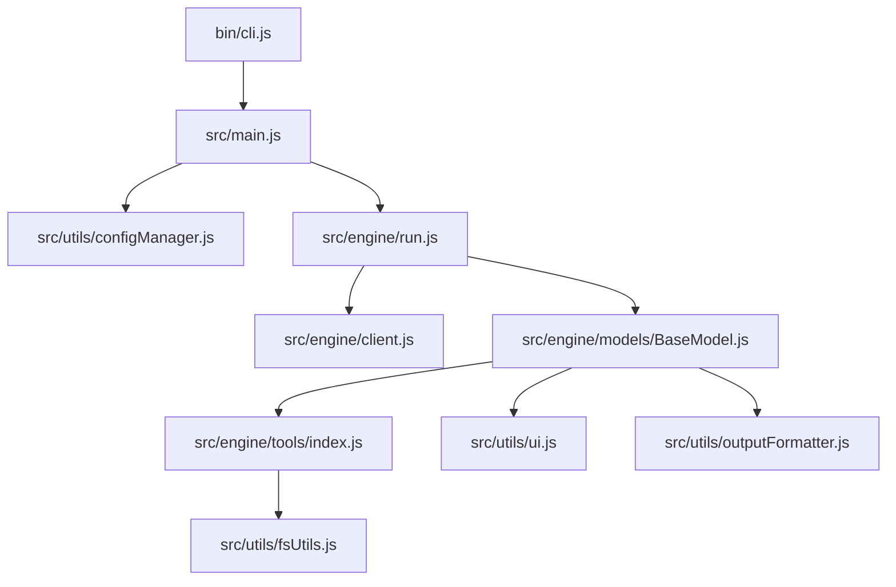

# Project Documentation: cowork-cli (cwk)

`cowork-cli` (`cwk`) is a high-speed, minimalist AI CLI analyst designed for developers. It functions as a context-aware co-processor that investigates codebases using a tool-calling loop to provide precise technical answers.

---

## Architecture Overview

The application is structured into three primary layers: the CLI entry point, the AI orchestration engine, and utility modules.



---

## File Directory & Specifications

### 🚀 Entry Point
* [bin/cli.js](file:///data/data/com.termux/files/home/works/cwk/bin/cli.js)
  * Executable entry point (`#!/usr/bin/env node`).
  * Establishes global error boundaries, catching `unhandledRejection` and `uncaughtException`.
  * Handles standard signal interrupts (`SIGINT`) to restore the terminal cursor (`\x1b[?25h`) and exit cleanly.
  * Passes command-line arguments to the orchestrator.

### ⚙️ Orchestration
* [src/main.js](file:///data/data/com.termux/files/home/works/cwk/src/main.js)
  * Orchestrates the startup CLI flow.
  * Parses arguments (handles version `-v`/`--version` and help `-h`/`--help` flags).
  * Loads and validates user configurations.
  * Verifies connectivity before executing any queries.
* [src/engine/run.js](file:///data/data/com.termux/files/home/works/cwk/src/engine/run.js)
  * Reads the system prompt template from [sys.txt](file:///data/data/com.termux/files/home/works/cwk/src/configs/sys.txt).
  * Dynamically interpolates the current working directory (`${folder}`) and current year (`${year}`) into the system prompt.
  * Decides whether to instantiate a [GeminiModel](file:///data/data/com.termux/files/home/works/cwk/src/engine/models/gemini.js) or a [DefaultModel](file:///data/data/com.termux/files/home/works/cwk/src/engine/models/default.js) based on configuration.
* [src/engine/client.js](file:///data/data/com.termux/files/home/works/cwk/src/engine/client.js)
  * Initializes the `OpenAI` client SDK.
  * Trims trailing slashes from the API base URL to prevent endpoint structure issues.
  * Sets an API request timeout limit of 60 seconds.

### 🧠 Model Handlers
* [src/engine/models/BaseModel.js](file:///data/data/com.termux/files/home/works/cwk/src/engine/models/BaseModel.js)
  * Core execution loop handling model interactions.
  * Enforces a maximum limit of 15 turns per query to prevent infinite tool loops.
  * Implements proactive throttling (minimum 1 second between requests).
  * Performs retry logic with exponential backoff and random jitter for transient errors (429, 500, 502, 503, 504), reading the `retry-after` header if provided.
  * Dispatches tool executions, formats inputs, feeds results back to message history, and handles execution exceptions.
* [src/engine/models/default.js](file:///data/data/com.termux/files/home/works/cwk/src/engine/models/default.js)
  * Standard handler that inherits directly from `BaseModel` for general OpenAI-compatible endpoints.
* [src/engine/models/gemini.js](file:///data/data/com.termux/files/home/works/cwk/src/engine/models/gemini.js)
  * Dedicated Gemini model handler.
  * Overrides the response handler to preserve metadata fields like `thought_signature`, preventing API payload mismatches when feeding tool-call history back to Gemini models.

### 🛠️ Core Tools
Located under [src/engine/tools/](file:///data/data/com.termux/files/home/works/cwk/src/engine/tools/):
* [index.js](file:///data/data/com.termux/files/home/works/cwk/src/engine/tools/index.js)
  * Houses OpenAI-compatible JSON tool declarations.
  * Registers tool implementations and provides the `dispatchTool` resolver.
* [askUser.js](file:///data/data/com.termux/files/home/works/cwk/src/engine/tools/askUser.js)
  * Prompting interface that asks the user a text question in the terminal.
  * Validates interactive status (`stdin.isTTY`), moves/clears lines for empty answers, and supports signal cancels (`SIGINT`).
* [findDir.js](file:///data/data/com.termux/files/home/works/cwk/src/engine/tools/findDir.js)
  * Searches directory names recursively matching a regex pattern. Results are capped at 15 matches.
* [findFile.js](file:///data/data/com.termux/files/home/works/cwk/src/engine/tools/findFile.js)
  * Finds files recursively matching a regex pattern on their filename. Results are capped at 15 matches.
* [listTools.js](file:///data/data/com.termux/files/home/works/cwk/src/engine/tools/listTools.js)
  * Lists all available tools, usage examples, and when to use them.
* [projectTree.js](file:///data/data/com.termux/files/home/works/cwk/src/engine/tools/projectTree.js)
  * Generates a folder structure representation. Stops recursion at depth 10 or 500 items.
* [readDir.js](file:///data/data/com.termux/files/home/works/cwk/src/engine/tools/readDir.js)
  * Returns contents of a directory, prefixing folders with `[D]` and files with `[F]`.
* [readFile.js](file:///data/data/com.termux/files/home/works/cwk/src/engine/tools/readFile.js)
  * Reads full file contents. Limits reads to files under 1MB.
  * Scans the first 1KB of the file for null bytes (`0`) to reject binary files.
* [readFileChunk.js](file:///data/data/com.termux/files/home/works/cwk/src/engine/tools/readFileChunk.js)
  * Reads specific lines (1-based range) from a file. Includes the same binary check as `readFile.js`.
* [searchText.js](file:///data/data/com.termux/files/home/works/cwk/src/engine/tools/searchText.js)
  * Searches file contents recursively for matching regex lines.
  * Skips binary files and enforces limits: max 20 matches per file, max 100 matches total, and max recursion depth of 10.
* [webFetch.js](file:///data/data/com.termux/files/home/works/cwk/src/engine/tools/webFetch.js)
  * Fetches and cleans text from public URLs.
  * **SSRF Protection:** Resolves hosts using `dns.lookup` and parses IPs to ensure they are strictly in the public `unicast` range. link-local, loopback, private, benchmark, and multicast addresses are blocked.
  * Manually follows redirects up to 5 hops, validating safety at each redirect hop.
  * Strips HTML tags (scripts, styles, headers, footers, etc.) and truncates text to 15,000 characters.

### 🔧 Utility Modules
Located under [src/utils/](file:///data/data/com.termux/files/home/works/cwk/src/utils/):
* [configManager.js](file:///data/data/com.termux/files/home/works/cwk/src/utils/configManager.js)
  * Loads configurations from `~/.env` using `dotenv`.
  * Supports multiple prefix variations for flexibility:
    * **Model Name:** `CWK_MODEL_NAME`, `MODEL_NAME`
    * **Model URL:** `CWK_MODEL_URL`, `MODEL_URL`
    * **API Key:** `CWK_MODEL_API_KEY`, `MODEL_API_KEY`
    * **Model Type:** `CWK_MODEL_TYPE`, `MODEL_TYPE`
  * Validates configuration schema (`openai` or `gemini` types) and runs connectivity checks via `client.models.list()`.
* [fsUtils.js](file:///data/data/com.termux/files/home/works/cwk/src/utils/fsUtils.js)
  * Reads `.gitignore` patterns in the current working directory.
  * Combines them with built-in default ignores (`.git`, `node_modules`, `dist`, `build`, `.npm`, `.DS_Store`) to determine whether paths should be skipped.
* [logger.js](file:///data/data/com.termux/files/home/works/cwk/src/utils/logger.js)
  * Converts hex colors from `config.json` into ANSI TrueColor escape sequences.
  * Outputs styled main (orange), secondary (grey), normal (white), and error strings.
* [outputFormatter.js](file:///data/data/com.termux/files/home/works/cwk/src/utils/outputFormatter.js)
  * Wraps text dynamically based on the current terminal column width (defaults to 80).
  * Preserves leading indentation spaces and splits long strings/words cleanly to prevent layout breaking.
* [ui.js](file:///data/data/com.termux/files/home/works/cwk/src/utils/ui.js)
  * Minimalist spinner using Braille rotation frames (`⣾`, `⣽`, `⣻`, etc.).
  * Shows/hides the cursor (`\x1b[?25l` / `\x1b[?25h`) and uses terminal line clearing escape sequences (`\r\x1b[K`) to prevent line duplication.
* [helpMsg.js](file:///data/data/com.termux/files/home/works/cwk/src/utils/helpMsg.js)
  * Minimalist usage screen explaining flags, examples, and environment variables.

---

## Key Configurations & Customization

### Application Configuration
Default UI themes and colors are configured in:
* [src/configs/config.json](file:///data/data/com.termux/files/home/works/cwk/src/configs/config.json)

```json
{
  "accents": {
    "orangex": "#D97757",
    "greyx": "#808080",
    "resetx": "#FFFFFF"
  }
}
```

### System Instructions
The AI's core logic and mandates are defined in a dedicated plain-text file:
* [src/configs/sys.txt](file:///data/data/com.termux/files/home/works/cwk/src/configs/sys.txt)

---

## Development Guidelines

### ES Module Standard
All files are ES Modules. When adding imports, always specify the file extension:
```javascript
import { logger } from "../utils/logger.js";
```

### Adding New Tools
1. Create your tool file under `src/engine/tools/<toolName>.js`. Export a default async function.
2. Define its JSON schema in the `toolDefinitions` array inside [src/engine/tools/index.js](file:///data/data/com.termux/files/home/works/cwk/src/engine/tools/index.js).
3. Import and add your tool implementation to `toolImplementations` inside [src/engine/tools/index.js](file:///data/data/com.termux/files/home/works/cwk/src/engine/tools/index.js).
4. Update semantic tool logging mapping inside the `_processToolCalls` method in [BaseModel.js](file:///data/data/com.termux/files/home/works/cwk/src/engine/models/BaseModel.js) to display status updates.
