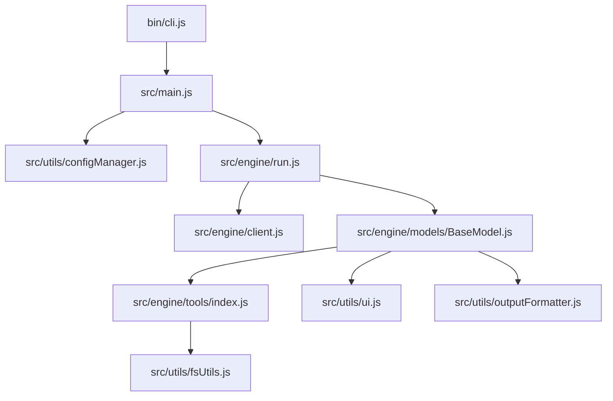

# Project Documentation: cowork-cli (cwk)

`cowork-cli` (`cwk`) is a high-speed, minimalist AI CLI analyst designed for developers. It functions as a context-aware co-processor that investigates codebases using a tool-calling loop to provide precise technical answers.

---

## Architecture Overview

The application is structured into three primary layers: the CLI entry point, the AI orchestration engine, and utility modules.



---

## File Directory & Specifications

### 🚀 Entry Point
* [bin/cli.js](file:///data/data/com.termux/files/home/works/cwk/bin/cli.js)
  * Executable entry point (`#!/usr/bin/env node`).
  * Establishes global error boundaries, catching `unhandledRejection` and `uncaughtException`.
  * Handles standard signal interrupts (`SIGINT`) to restore the terminal cursor (`\x1b[?25h`) and exit cleanly.
  * Passes command-line arguments to the orchestrator.

### ⚙️ Orchestration
* [src/main.js](file:///data/data/com.termux/files/home/works/cwk/src/main.js)
  * Orchestrates the startup CLI flow.
  * Parses arguments (handles version `-v`/`--version` and help `-h`/`--help` flags).
  * Loads and validates user configurations.
  * Verifies connectivity before executing any queries.
* [src/engine/run.js](file:///data/data/com.termux/files/home/works/cwk/src/engine/run.js)
  * Reads the system prompt template from [sys.txt](file:///data/data/com.termux/files/home/works/cwk/src/configs/sys.txt).
  * Dynamically interpolates the current working directory (`${folder}`) and current year (`${year}`) into the system prompt.
  * Decides whether to instantiate a [GeminiModel](file:///data/data/com.termux/files/home/works/cwk/src/engine/models/gemini.js) or a [DefaultModel](file:///data/data/com.termux/files/home/works/cwk/src/engine/models/default.js) based on configuration.
* [src/engine/client.js](file:///data/data/com.termux/files/home/works/cwk/src/engine/client.js)
  * Initializes the `OpenAI` client SDK.
  * Trims trailing slashes from the API base URL to prevent endpoint structure issues.
  * Sets an API request timeout limit of 60 seconds.

### 🧠 Model Handlers
* [src/engine/models/BaseModel.js](file:///data/data/com.termux/files/home/works/cwk/src/engine/models/BaseModel.js)
  * Core execution loop handling model interactions.
  * Enforces a maximum limit of 15 turns per query to prevent infinite tool loops.
  * Implements proactive throttling (minimum 1 second between requests).
  * Performs retry logic with exponential backoff and random jitter for transient errors (429, 500, 502, 503, 504), reading the `retry-after` header if provided.
  * Dispatches tool executions, formats inputs, feeds results back to message history, and handles execution exceptions.
* [src/engine/models/default.js](file:///data/data/com.termux/files/home/works/cwk/src/engine/models/default.js)
  * Standard handler that inherits directly from `BaseModel` for general OpenAI-compatible endpoints.
* [src/engine/models/gemini.js](file:///data/data/com.termux/files/home/works/cwk/src/engine/models/gemini.js)
  * Dedicated Gemini model handler.
  * Overrides the response handler to preserve metadata fields like `thought_signature`, preventing API payload mismatches when feeding tool-call history back to Gemini models.

### 🛠️ Core Tools
Located under [src/engine/tools/](file:///data/data/com.termux/files/home/works/cwk/src/engine/tools/):
* [index.js](file:///data/data/com.termux/files/home/works/cwk/src/engine/tools/index.js)
  * Houses OpenAI-compatible JSON tool declarations.
  * Registers tool implementations and provides the `dispatchTool` resolver.
* [askUser.js](file:///data/data/com.termux/files/home/works/cwk/src/engine/tools/askUser.js)
  * Prompting interface that asks the user a text question in the terminal.
  * Validates input and interactive status (`stdin.isTTY`), then delegates entirely to `ui.ask()` from the `UIEngine` singleton.
  * Returns `{ answer }` on success or `{ error, dismissed: true }` on cancellation / error.
* [askConfirm.js](file:///data/data/com.termux/files/home/works/cwk/src/engine/tools/askConfirm.js)
  * Prompting interface that asks the user a yes/no question using a sleek interactive toggle.
  * Delegates entirely to `ui.confirm()` from the `UIEngine` singleton.
  * Returns `{ confirmed: true|false }` or `{ confirmed: false, dismissed: true }` on cancellation.
* [findDir.js](file:///data/data/com.termux/files/home/works/cwk/src/engine/tools/findDir.js)
  * Searches directory names recursively matching a regex pattern. Results are capped at 15 matches.
  * Validates the root path with `safePath` before any `fs` call, blocking traversal outside the project.
  * Uses `isSafeEntry` per entry (rejects symlinks, ignored names, sandbox escapes) and merges nested `.gitignore` files via `loadNestedIgnores` when recursing into subdirectories.
* [findFile.js](file:///data/data/com.termux/files/home/works/cwk/src/engine/tools/findFile.js)
  * Finds files recursively matching a regex pattern on their filename. Results are capped at 15 matches.
  * Validates the root path with `safePath` before any `fs` call, blocking traversal outside the project.
  * Uses `isSafeEntry` per entry (rejects symlinks, ignored names, sandbox escapes) and merges nested `.gitignore` files via `loadNestedIgnores` when recursing into subdirectories.
* [listTools.js](file:///data/data/com.termux/files/home/works/cwk/src/engine/tools/listTools.js)
  * Lists all available tools, usage examples, and when to use them.
* [projectTree.js](file:///data/data/com.termux/files/home/works/cwk/src/engine/tools/projectTree.js)
  * Generates a folder structure representation. Stops recursion at depth 10 or 500 items.
  * Validates the root path with `safePath` (replaces the previous bare `path.resolve`).
  * Uses `isSafeEntry` per entry and merges nested `.gitignore` files via `loadNestedIgnores` before each recursive `buildTree` call.
* [readDir.js](file:///data/data/com.termux/files/home/works/cwk/src/engine/tools/readDir.js)
  * Returns contents of a directory, prefixing folders with `[D]` and files with `[F]`.
  * Validates the path with `safePath` and filters entries through `isSafeEntry` (symlink rejection + ignore + sandbox).
* [readFile.js](file:///data/data/com.termux/files/home/works/cwk/src/engine/tools/readFile.js)
  * Reads full file contents. Limits reads to files under 1MB.
  * Scans the first 1KB of the file for null bytes (`0`) to reject binary files.
  * Validates the path with `safePath` before any `fs` call, blocking path traversal.
* [readFileChunk.js](file:///data/data/com.termux/files/home/works/cwk/src/engine/tools/readFileChunk.js)
  * Reads specific lines (1-based range) from a file. Includes the same binary check as `readFile.js`.
  * Validates the path with `safePath` before any `fs` call, blocking path traversal.
* [searchText.js](file:///data/data/com.termux/files/home/works/cwk/src/engine/tools/searchText.js)
  * Searches file contents recursively for matching regex lines.
  * Skips binary files and enforces limits: max 20 matches per file, max 100 matches total, and max recursion depth of 10.
  * Validates the root path with `safePath` and uses `isSafeEntry` + `loadNestedIgnores` inside the recursive walk.
* [webFetch.js](file:///data/data/com.termux/files/home/works/cwk/src/engine/tools/webFetch.js)
  * Fetches and cleans text from public URLs.
  * **SSRF Protection:** Resolves hosts using `dns.lookup` and parses IPs to ensure they are strictly in the public `unicast` range. link-local, loopback, private, benchmark, and multicast addresses are blocked.
  * Manually follows redirects up to 5 hops, validating safety at each redirect hop.
  * Strips HTML tags (scripts, styles, headers, footers, etc.) and truncates text to 15,000 characters.

### 🔧 Utility Modules
Located under [src/utils/](file:///data/data/com.termux/files/home/works/cwk/src/utils/):
* [configManager.js](file:///data/data/com.termux/files/home/works/cwk/src/utils/configManager.js)
  * Loads configurations from `~/.env` using `dotenv`.
  * Supports multiple prefix variations for flexibility:
    * **Model Name:** `CWK_MODEL_NAME`, `MODEL_NAME`
    * **Model URL:** `CWK_MODEL_URL`, `MODEL_URL`
    * **API Key:** `CWK_MODEL_API_KEY`, `MODEL_API_KEY`
    * **Model Type:** `CWK_MODEL_TYPE`, `MODEL_TYPE`
  * Validates configuration schema (`openai` or `gemini` types) and runs connectivity checks via `client.models.list()`.
* [fsUtils.js](file:///data/data/com.termux/files/home/works/cwk/src/utils/fsUtils.js)
  * **Ignore-pattern engine** — parses `.gitignore` files into structured pattern objects supporting globs (`*`, `**`, `?`, `[…]`), directory-only markers (`build/`), and full negation (`!important.log`). Uses a zero-dependency `globToRegex` converter.
  * **Expanded default ignores:** `.git`, `.svn`, `.hg`, `node_modules`, `dist`, `build`, `.npm`, `.DS_Store`, `Thumbs.db`, `.env`, `.env.*`, `coverage`, `__pycache__`, `.cache`, `.vscode`, `.idea`.
  * `getIgnorePatterns()` — loads defaults + root `.gitignore`, caches the result for the process lifetime. Rejects `.gitignore` files larger than 64 KB and strips `\r` line endings.
  * `shouldIgnore(name, ignoreList, options?)` — glob-aware, negation-aware matching. Processes patterns sequentially (last match wins). Accepts optional `{ isDirectory }` for directory-only enforcement; omitting it preserves backward compatibility.
  * `loadNestedIgnores(dirPath, parentList)` — reads a `.gitignore` in a subdirectory and merges its patterns after the parent list, enabling recursive ignore discovery by callers.
  * `safePath(inputPath)` — resolves a path against `process.cwd()` and throws if it escapes the project root. Prevents `../` traversal attacks.
  * `isSafeEntry(dirent, parentPath, ignoreList)` — combined guard that rejects symbolic links, ignored names, and paths resolving outside the sandbox.
  * `clearIgnoreCache()` — invalidates the cached pattern list.
* [logger.js](file:///data/data/com.termux/files/home/works/cwk/src/utils/logger.js)
  * Reads the color tokens (`main`, `tool`, `data`, `success`, `error`, `dim`, `header`) from `config.json` and converts them to ANSI TrueColor sequences.
  * Exports `formatMain`, `formatSecondary`, `formatNormal`, `formatError`, `formatDim`, `formatHeader` formatting helpers.
  * Exports `logger` object with `.main()`, `.secondary()`, `.normal()`, and `.error()` convenience methods.
* [outputFormatter.js](file:///data/data/com.termux/files/home/works/cwk/src/utils/outputFormatter.js)
  * Wraps text dynamically based on the current terminal column width (defaults to 80).
  * Preserves leading indentation spaces and splits long strings/words cleanly to prevent layout breaking.
* [ui.js](file:///data/data/com.termux/files/home/works/cwk/src/utils/ui.js)
  * `UIEngine` — State-Based Reactive Terminal Interface.
  * **Four states:** `IDLE → SPINNING → IDLE`, `IDLE → THINKING → IDLE`, `IDLE → ASKING → IDLE`.
  * **Virtual DOM:** `_vdom { frame, label, data }` tracks exactly what is on screen. Every tick diffs against it and patches only what changed.
  * **Three patch operations** (no full-line clears during animation):
    * `_patchFrame(frame)` — overwrites 1 char at col 0, `~22 bytes/tick`.
    * `_patchFromLabel(label, data)` — repaints from col 2 onward (label change in THINKING mode, ~1/8 ticks).
    * `_patchFromData(label, data)` — repaints from `(` col onward (on `update()` call only).
  * **Design tokens:** `COLORS` (`main` blue, `tool` amber, `data` silver, `success` green, `error` red, `dim` grey, `header` purple), `THOUGHTS` word list, `GLYPHS` (`● ◇ > ⣾…`).
  * **Glyph `●`** is color-coded: green (`COLORS.success`) on `stop()`, red (`COLORS.error`) on `fail()`.
  * `ui.start(label, data?)` — enter SPINNING. Silently replaces any active spinner.
  * `ui.think()` — enter THINKING (rotating thought words). Replaces any active spinner.
  * `ui.update(data)` — swap data field in-place; no-ops if truncated value unchanged.
  * `ui.stop(msg?)` — SPINNING/THINKING → IDLE, prints `● green label (msg)`.
  * `ui.fail(msg?)` — SPINNING/THINKING → IDLE, prints `● red label (msg)`.
  * `ui.log(text)` — safe from any state; lifts above spinner if active.
  * `ui.ask(question)` — styled `◇ Question` prompt. TTY-safe, SIGINT-cancellable, re-prompts on empty. Resolves to trimmed string; rejects `{ cancelled: true }` on SIGINT.
  * `ui.header(title)` — prints `◆ title` via `log()`.
  * `ui.footer(duration)` — prints dim elapsed-time line via `log()`.
  * `ui.cleanup()` — `_abort()` + show cursor; safe from any state.
  * `ui.state` — read-only getter returning current state string.
  * Exported singleton: `export const ui = new UIEngine()`.
  * Auto full-repaint on terminal `resize` event (truncation bounds change).
* [helpMsg.js](file:///data/data/com.termux/files/home/works/cwk/src/utils/helpMsg.js)
  * Minimalist usage screen explaining flags, examples, and environment variables.

---

## Key Configurations & Customization

### Application Configuration
Default UI themes and colors are configured in:
* [src/configs/config.json](file:///data/data/com.termux/files/home/works/cwk/src/configs/config.json)

```json
{
  "accents": {
    "main":    "#7BA5DA",
    "tool":    "#F2CF6E",
    "data":    "#C2C6C5",
    "success": "#7AC391",
    "error":   "#E07070",
    "dim":     "#606060",
    "header":  "#A37ACC"
  }
}
```

### System Instructions
The AI's core logic and mandates are defined in a dedicated plain-text file:
* [src/configs/sys.txt](file:///data/data/com.termux/files/home/works/cwk/src/configs/sys.txt)

---

## Development Guidelines

### ES Module Standard
All files are ES Modules. When adding imports, always specify the file extension:
```javascript
import { logger } from "../utils/logger.js";
```

### Adding New Tools
1. Create your tool file under `src/engine/tools/<toolName>.js`. Export a default async function.
2. Define its JSON schema in the `toolDefinitions` array inside [src/engine/tools/index.js](file:///data/data/com.termux/files/home/works/cwk/src/engine/tools/index.js).
3. Import and add your tool implementation to `toolImplementations` inside [src/engine/tools/index.js](file:///data/data/com.termux/files/home/works/cwk/src/engine/tools/index.js).
4. Update semantic tool logging mapping inside the `_processToolCalls` method in [BaseModel.js](file:///data/data/com.termux/files/home/works/cwk/src/engine/models/BaseModel.js) to display status updates.
